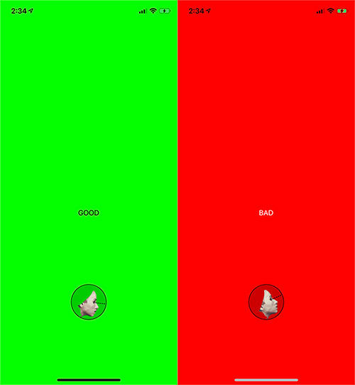

----

# baseBoseAR

Minimal Swift project to get Bose AR SDK integration going for other projects.

## Functionality

The app will present a Bose AR device picker. When you select, after a short amount of time I collect pitch sensor data from `gameRotation`. Above 0.3 is bad and below -0.2 is bad as well. Using official positive and negative tones from Goodyear. 

The screen turns red and green to match the state. This is for blind people who often tilt there heads back too far because some of them have no notion of the horizon and horizontal neck gazing. This is especially true of the young.

## Application

